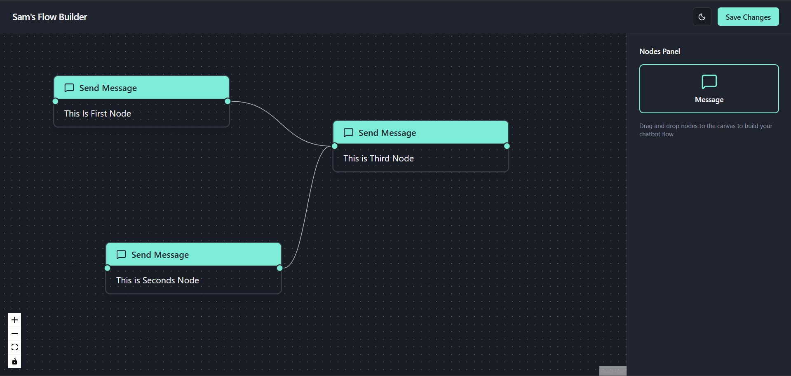
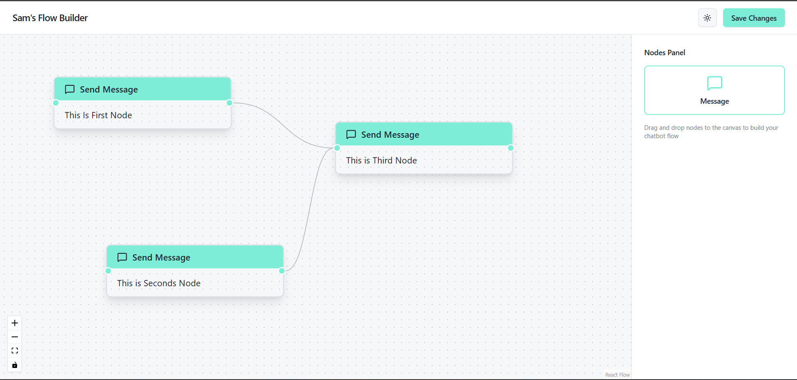

# 💬 Sam’s Flow Builder

A modern, minimal **Chatbot Flow Builder** built using **React Flow**, **TypeScript**, and **Shadcn UI**.  
This project allows users to visually create chatbot message flows by dragging and connecting message nodes.

---

## 🚀 Preview 

### 🌙 Dark Theme


### 💡 Light Theme


## 🚀 Overview

This flow builder lets you design conversational flows with **Text Message Nodes** — connect them visually using React Flow’s node-based interface.  
The UI is built with **Shadcn UI**, styled with **Tailwind CSS**, and includes **light/dark theme switching**.

---

## ✨ Features

### 🧩 Flow Builder
- Drag and drop **Text Nodes** from the **Nodes Panel**.
- Each node represents a chatbot message.
- Click a node to open the **Settings Panel** and edit its message text.
- Delete nodes individually from within the flow.
- Connect nodes using **edges** to define the conversation path.

### 🔗 Edge Rules
- Each node’s **source handle** (right side) can only have **one outgoing connection**.
- Each node’s **target handle** (left side) can accept **multiple incoming connections**.

### ⚙️ Settings Panel
- Appears when a node is selected.
- Allows editing the message text.
- Placeholder text is shown for new nodes (input starts empty).

### 🧱 Nodes Panel
- Contains the available node types (currently only the **Text Node**).
- Built to be **extensible** — easily add more node types later.
- Built Delete Node functionality when hover on the Node.

### 💾 Save Validation
- Validates the flow before saving:
  - Shows an error if **multiple nodes** lack incoming connections.
  - Displays a centered error message banner: *“Cannot save Flow”*.
- On successful validation, displays: *“Flow saved successfully!”* via toast.

### 🌓 Theme Support
- Includes a **Theme Toggle** (light/dark mode) built using **Shadcn UI**’s theme system.
- The entire app responds to theme changes instantly.

---

## 🧠 Tech Stack

| Tool / Library | Purpose |
|----------------|----------|
| **React 18 + TypeScript** | Core frontend framework |
| **Vite** | Fast build tool and dev server |
| **Tailwind CSS** | Styling and theming |
| **Shadcn UI** | UI components (Button, Input, Dialog, etc.) |
| **React Flow** | Flow builder and node-based canvas |
| **Lucide Icons** | Beautiful, lightweight icons |
| **Sonner** | Toast notifications |
| **Framer Motion (optional)** | Animations (for transitions) |

---

## ⚙️ Installation & Setup

### 1️⃣ Clone the repository
```bash
git clone https://github.com/SamuelMasih777/chatbot-flow-builder.git
cd chatbot-flow-builder

npm install 

npm run dev
